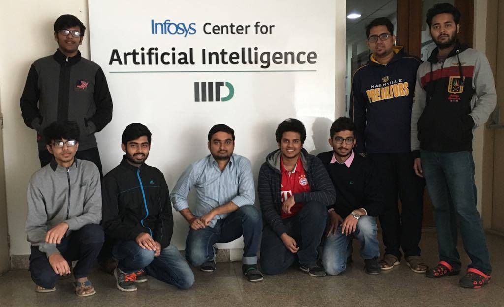

# Laboratory for Computational Social Systems (LCS2)

The project template is originated at the University of Washington.  You can see the machinery working live at [our site][sampa].

This work is licensed under a [Creative Commons Attribution-NonCommercial 4.0 International License][license].

[sampa]: http://sampa.cs.washington.edu/
[license]: https://creativecommons.org/licenses/by-nc/4.0/

